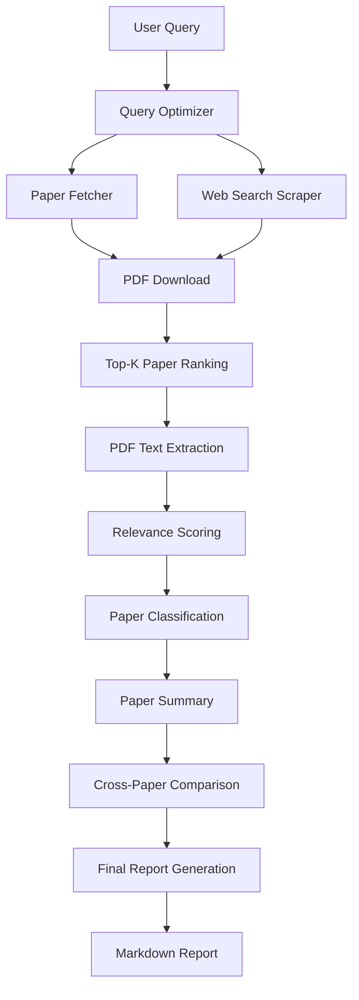

# 🔬 Scientific Research Multi-Agent Pipeline

A powerful, automated multi-agent system designed to optimize research queries, fetch academic papers from multiple sources, scrape relevant web content, and generate comprehensive research reports using LLMs.

---

## 🚀 Overview

This pipeline automates the entire research process, from initial query formulation to the generation of a polished, multi-perspective research report. It leverages **Ollama** for local AI processing, **Firecrawl** for web scraping, and multiple academic APIs for paper retrieval.

### 🛠 Pipeline Workflow



---

## 📦 Installation & Setup

### 1. Clone the Repository
```bash
git clone https://github.com/smitpatel674/Scientific-Research-Multi-Agent-System
cd scientific_research_agent
```

### 2. Install Python Dependencies
```bash
pip install -r requirements.txt
python -m playwright install chromium
```

### 3. Local Services Required

#### **Ollama (Local LLM)**
Ensure Ollama is installed and running.
```bash
# Start Ollama
ollama serve

# Pull the required model
ollama pull qwen3:8b
```

#### **Firecrawl (Web Scraping)**
The pipeline expects a local Firecrawl instance for web search and scraping.
- [Firecrawl Documentation](https://docs.firecrawl.dev/)
- Default local URL: `http://localhost:3002`

### 4. Environment Variables (Optional)
Create a `.env` file in the root directory if you want to use external API keys or custom URLs:
```env
FIRECRAWL_API_URL=http://localhost:3002
FIRECRAWL_API_KEY=your_key_here
NCBI_API_KEY=your_ncbi_key_here
SEMANTIC_SCHOLAR_API_KEY=your_key_here
```

---

## 🏃 Usage

Run the entire pipeline with a single command:

```bash
python orchestrator.py
```

1.  **Enter Search Query**: The script will prompt you for a research topic.
2.  **Configuration**: It will automatically save runtime settings.
3.  **Execution**: The multi-agent pipeline will run sequentially.
4.  **Final Output**: Your research report will be saved in `research_outputs/report/final_research_report.md`.

---

## 📁 Project Structure

- `orchestrator.py`: The entry point script that orchestrates the flow using LangGraph.
- `paper_fetcher.py`: Fetches papers from arXiv, Semantic Scholar, Crossref, PubMed, and Europe PMC.
- `search_scrape.py`: Scrapes web search results via Firecrawl and converts them to PDFs.
- `pdf_extract.py`: Extracts text content from downloaded PDFs using PyMuPDF.
- `ollama_utils.py`: Helper functions for interacting with the local Ollama instance.
- `research_outputs/`: Main directory for all generated data and the final report.
- `downloaded_papers/`: Stores all originally downloaded PDF papers.

---

## 📋 Key Features

- **Multi-Source Retrieval**: Searches across 5+ academic databases simultaneously.
- **Smart Query Expansion**: Uses LLMs to turn simple keywords into professional search queries.
- **Automated Scraping**: Fallback to web scraping if direct PDF links are unavailable.
- **Local AI Privacy**: Entire processing (summarization, classification, comparison) happens locally via Ollama.
- **Professional Reports**: Generates structured Markdown reports with citations and cross-paper analysis.

---

## 🛠 Troubleshooting

- **Ollama Connection**: Ensure `ollama serve` is running and the model `qwen3:8b` is pulled.
- **Firecrawl**: If not using Firecrawl, the web search step may fail. Ensure the local server is active.
- **Playwright**: If PDF downloads fail, ensure `playwright install chromium` was successful.

---

> [!TIP]
> For best results, use specific research queries like "Performance comparison of Sparse Transformers vs Standard Transformers on NLP tasks".
# Scientific-Research-Multi-Agent-System
